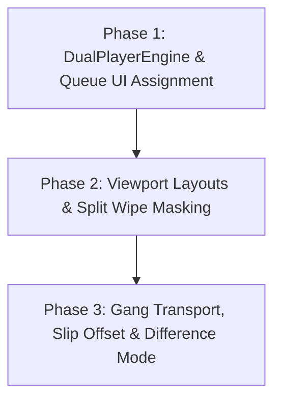

# Feasibility Study & Architectural Plan: Multi-Video Canvas, 2-Video Streamlining, A/B Split-Screen & Queue Assignment

**Document Version:** 2.1.0  
**Project:** QC (VideoQCApp / VideoQCLib)  
**Status:** Feasibility & Architectural Planning Only (DO NOT ACTION)  
**Date:** September 2026  

---

## 1. Executive Summary & Core Findings

This document explores the technical feasibility, architectural design, performance implications, and UX workflow for expanding QC's Premiere-style Player into a multi-asset comparison workstation.

### Key Questions Addressed:
1. **Is the original 4-video floating canvas doable?**  
   **Yes (Complexity: 7.5 / 10)**. Feasible on Apple Silicon, but requires managing 4 simultaneous decode buffers, complex floating-window geometry, and N-way synchronization.
2. **What if we limit the system to 2 videos at a time? Would it be easier?**  
   **DRAMATICALLY EASIER (Complexity: 4.5 / 10 — a ~40% reduction in complexity).**  
   Limiting to a dual-video architecture eliminates window collision management, halves memory bandwidth and hardware decode load, and turns synchronization into a clean, rock-solid binary master-follower relationship.
3. **Can we support an interactive A/B Split-Screen (Wipe) comparison?**  
   **YES — this is the ultimate QC feature.**  
   Instead of just floating side-by-side, Video A and Video B can be overlaid with a draggable vertical or horizontal wipe line, allowing inspectors to slide back and forth across the exact same frame to detect line glitches, color grade shifts, and compression artifacts. Furthermore, a **Difference Matte (Delta)** mode can be added with near-zero overhead.
4. **How do we assign Video A and Video B from our current Queue List?**  
   **Seamlessly integrated into the existing Queue UI.**  
   We can add in-row `[A]` and `[B]` badges, a Queue Header target toggle (`[• SLOT A] [SLOT B]`), right-click context menu assignments, and `⌥ + Click` quick shortcuts. When Slot B is unassigned, the player behaves exactly as it does today with zero UI clutter.

---

## 2. Feasibility & Complexity Scorecard: 4-Video vs. 2-Video

| Feature / Dimension | 4-Video Floating Canvas | 2-Video Dual / Split System | Difference & Impact |
| :--- | :--- | :--- | :--- |
| **Overall Complexity** | 🟡 **7.5 / 10 (High)** | 🟢 **4.5 / 10 (Low-Moderate)** | **~40% simpler**; faster to build, easier to test, fewer edge cases. |
| **Hardware Decode Load** | 4 concurrent hardware streams | 2 concurrent hardware streams | Halves memory and GPU load; 100% reliable on base M1/Intel. |
| **Synchronization** | N-way master-clock scheduling | Binary Master/Follower sync | Follower sync tracking is trivial; drift detection is instantaneous. |
| **Canvas UX & Gestures** | Freeform window drag, resize, z-index | Clean presets: Side-by-Side, Top/Bottom, PiP, Split Wipe | No window collisions, no z-index bugs, no accidental offscreen drags. |
| **A/B Split-Screen Wipe** | Impractical with 4 videos | 🟢 **Native, pixel-perfect** | Enables industry-standard wipe compare and difference blending. |
| **Queue Assignment** | 4 slot selectors per item | Clean `[A]` and `[B]` pills | Very compact, intuitive, and preserves existing single-file workflow. |
| **Scrubber & Transport** | 4 clip durations / rates | 2 clip durations (A vs B) | Very intuitive; primary scrubber follows Slot A or Slot B. |
| **Audio Routing** | 4-channel matrix | Binary A / B toggle | Zero risk of audio phase cancellation or confusion. |
| **QC Utility Value** | High (Multi-cam review) | **Extremely High (Before/After QC)** | Mastering vs Delivery, SDR vs HDR, Glitch vs Fixed comparisons. |

---

## 3. The 2-Video Advantage: Why It Is Superior for QC

Limiting the canvas to 2 simultaneous videos offers profound architectural and usability advantages:

### 1. The Industry Standard QC Paradigm
Video QC operators rarely need to watch 4 unrelated videos at once. Instead, **95% of comparative QC workflows are strictly pairwise (A vs B)**:
- **Master vs. Delivery**: Comparing an uncompressed ProRes 422HQ master against a high-efficiency H.264/HEVC web or broadcast delivery file.
- **Clean vs. Glitched**: Comparing the raw camera capture against a version flagged by the Line Scanner for edge anomalies.
- **Color Grade / SDR vs. HDR**: Comparing Rec.709 against Rec.2020/HLG color conversions.
- **Audio QC**: Comparing original 5.1/Stereo mix against encoded AAC/AC3.

### 2. Elimination of Floating Window Chaos
Managing 4 floating, resizable, draggable windows inside a zoomable/pannable canvas introduces substantial UX friction:
- Windows overlap, requiring complex z-index management.
- Small laptop screens (e.g. 13" or 14" MacBook Pro) quickly become cluttered.
- Mouse clicks must differentiate between: selecting a window, dragging a window, resizing a window handle, or panning the background canvas.
- With 2 videos, the UI snaps effortlessly into structured, beautiful layouts: **Split Screen Wipe**, **Side-by-Side (50/50)**, **Top/Bottom**, or **Picture-in-Picture (PiP)**.

---

## 4. Deep Dive: The A/B Split-Screen Comparison Engine

An interactive A/B comparison system elevates QC from a simple media player into a specialized visual analysis workstation.

```
┌───────────────────────────────────────────────────────────────────────────────┐
│                     A/B SPLIT-SCREEN WIPE COMPARISON                          │
├───────────────────────────────────────────────────────────────────────────────┤
│                                                                               │
│          ◀── VIDEO A (Master) ──▶   │   ◀── VIDEO B (Delivery) ──▶            │
│                                     │                                         │
│                                     │  ◄── Interactive Split Line             │
│                                     │      (Draggable Left / Right)           │
│                                     ▲                                         │
│                                   [ ◄► ] ◄─ Scrubber Handle                   │
│                                     ▼                                         │
│                                     │                                         │
│                                     │                                         │
│                                     │                                         │
└───────────────────────────────────────────────────────────────────────────────┘
```

### A/B Comparison Modes:

#### Mode 1: Interactive Vertical Wipe (Curtain)
- **Concept**: Video A and Video B are scaled to identical dimensions and overlaid directly on top of each other.
- **Interaction**: A crisp vertical split line divides the frame. The left half displays Video A; the right half displays Video B.
- **Draggable Handle**: The user drags the divider line left and right across the frame. While dragging, both videos remain locked in playback or paused frame synchronization.
- **Application**: Allows pixel-accurate inspection of fine edges, compression banding, or edge-line glitches across the exact same spatial coordinates.

#### Mode 2: Interactive Horizontal Wipe
- Same as vertical wipe, but divided horizontally (Top half = Video A, Bottom half = Video B). Ideal for letterboxed or ultrawide scope content.

#### Mode 3: Pixel Difference Matte (Delta Mode)
- **Concept**: A real-time difference blend mode: $\text{Output} = |\text{Pixel}_A - \text{Pixel}_B|$.
- **Behavior**:
  - If Video A and Video B are identical, the screen is **completely black**.
  - Any pixel discrepancy (compression blockiness, color shift, line dropouts, micro-jitter) **glows brightly** against the dark background.
- **QC Value**: Instant, foolproof detection of compression artifacts or frame drops between source and render.

#### Mode 4: Blink / Flicker Toggle (Rapid AB Compare)
- Pressing a single key (e.g., `\` or `Tab`) instantly flips the entire display between 100% Video A and 100% Video B.
- The human eye is exceptionally sensitive to motion; flicking between two aligned frames instantly reveals minute color shifts, edge fringing, or frame offsets.

---

## 5. Technical Implementation of the A/B Split Engine

Implementing the A/B split-screen in macOS using **AVFoundation** and **CoreAnimation (CALayer)** is fast, native, and computationally lightweight.

### Dual-Layer Masking Architecture (Zero Frame Copy)
Rather than manually blending pixel buffers on the CPU or setting up a heavy Metal shader pipeline, CoreAnimation provides hardware-accelerated layer masking:

```
[ Canvas Viewport ]
       │
       ├── [ Container Layer ]
       │         │
       │         ├── [ PlayerLayer B ] (Underneath, Full Frame: 1920x1080)
       │         │
       │         └── [ PlayerLayer A ] (On Top, Full Frame: 1920x1080)
       │                   │
       │                   └── [ CAShapeLayer Mask ] (Bounds: 0 ... splitX)
       │
       └── [ Split-Line Overlay Layer ] (Cyan 1.5px divider + draggable thumb)
```

- **Efficiency**: `AVPlayerLayer A` is clipped using a `CAShapeLayer` mask set to `CGRect(0, 0, splitX, height)`.
- **Zero GPU Penalty**: The GPU compositor in WindowServer clips the layers in hardware. Moving the split line only updates the mask frame—no re-decoding, no memory re-allocations, achieving a rock-solid **120 fps ProMotion** response during live dragging!

---

## 6. How We Assign Video A and B from the Current Queue List

In the current QC codebase, the left sidebar displays a single `filteredPlayerFiles` queue list where clicking a row immediately loads the file into `playerEngine`. 

To support assigning files to **Slot A** and **Slot B** cleanly and intuitively, we propose a **4-tier unified assignment architecture**:

```
┌───────────────────────────────────────────────────────────────────────────────┐
│                    QUEUE LIST: A/B ASSIGNMENT INTERFACE                       │
├───────────────────────────────────────────────────────────────────────────────┤
│                                                                               │
│  QUEUE (12)                 TARGET: [ • SLOT A ] [ SLOT B ]    [ ⇄ SWAP ]    │
│                                                                               │
│  ┌─────────────────────────────────────────────────────────────────────────┐  │
│  │ ▌ ▶ Master_Export_v01.mov                      [ A: MASTER ]  [ +B ]    │  │
│  │   3840x2160 • 25.0fps • ProRes 422HQ                                    │  │
│  ├─────────────────────────────────────────────────────────────────────────┤  │
│  │ ▌ ▶ Web_H264_1080p_v01.mov                     [ +A ]    [ B: COMPARE ] │  │
│  │   1920x1080 • 25.0fps • H.264                                           │  │
│  ├─────────────────────────────────────────────────────────────────────────┤  │
│  │   ▶ Archive_Clean_v02.mov                      [ +A ]    [ +B ]         │  │
│  │   1920x1080 • 25.0fps • ProRes 422                                      │  │
│  └─────────────────────────────────────────────────────────────────────────┘  │
│                                                                               │
└───────────────────────────────────────────────────────────────────────────────┘
```

### 1. In-Row Quick Badges (`[A]` and `[B]` Pills)
Inside `playerFileRow(url: URL)`:
- If a file is currently assigned to **Slot A**, it displays a vibrant cyan badge: `[ A: MASTER ]`.
- If a file is currently assigned to **Slot B**, it displays a vibrant amber/purple badge: `[ B: COMPARE ]`.
- Unassigned rows display subtle, low-opacity pills `[ +A ]` and `[ +B ]` on mouse hover.
- **1-Click Action**: Clicking `[ +A ]` immediately loads that file into Slot A. Clicking `[ +B ]` loads it into Slot B.

### 2. Header Target Selector (`[ • SLOT A ]` / `[ SLOT B ]` / `[ ⇄ SWAP ]`)
At the top of the Queue panel:
- A segmented control shows which slot is currently the active "Click Target":
  - When `SLOT A` is active (default), normal single-clicking any row in the list loads that file into Slot A.
  - When `SLOT B` is selected, clicking any row in the list loads that file into Slot B.
- A **`[ ⇄ SWAP ]`** button instantly swaps File A and File B.

### 3. Right-Click Context Menu Options
Right-clicking any video in the Queue list presents explicit assignment options:
```
▶ Set as Slot A (Master)
▶ Set as Slot B (Compare)
─────────────────────────────
⇄ Swap Slot A and Slot B
✕ Clear Slot B (Single View)
─────────────────────────────
Finder Tags >
Reveal in Finder
```

### 4. Direct Drag-and-Drop from Queue onto Canvas
Instead of clicking:
- The user can click and drag any file from the Queue list into the program monitor viewport:
  - Dragging onto the **left half** of the viewport highlights a cyan **"DROP AS SLOT A (MASTER)"** overlay.
  - Dragging onto the **right half** highlights an amber **"DROP AS SLOT B (COMPARE)"** overlay.
- Dragging files from the macOS Finder directly onto either half works identically.

### 5. Keyboard Modifiers (Power User Workflow)
- **Normal Click**: Loads into the currently active target slot.
- **Option-Click (`⌥ + Click`)**: Instantly loads that file directly into **Slot B** without changing the current Slot A file!
- **Key `X`**: Swaps Slot A and Slot B.
- **Key `Shift + Delete`**: Clears Slot B and returns to Single Video Player mode.

### 6. Graceful Single-Video Default
When Slot B is empty (the default on app launch):
- The player behaves **100% identically to the current QC player**.
- The viewport displays Slot A full-frame.
- There is zero extra visual clutter. Only when a file is assigned to Slot B does the comparison toolbar and split-screen mode unlock!

---

## 7. Playback Synchronization: Binary Master/Follower

With 2 videos, synchronization is vastly simpler and more robust than with 4 videos:

### 1. The Master/Follower Hierarchy
- Whichever slot is highlighted (Slot A by default) acts as the **Master Clock**.
- Slot B acts as the **Follower Clock**.
- When the user presses `Space`, `L`, `J`, or scrubs:
  1. The Master executes the command immediately.
  2. The Follower is issued a synchronized seek or rate command matching the master's timecode offset.

### 2. Time Offset Alignment (Slip Sync Tool)
Often, two versions of a video do not share the exact same start frame (e.g. Version B has a 2-second slate or 8 frames of pre-roll).
- **Slip / Sync Offset Tool**: A simple `+` / `-` frame nudge button for Slot B allows the operator to align the two videos on an exact sync point (e.g., clapper board, 2-pop, or first frame of action).
- Once locked, the engine maintains this fixed frame offset:
  $$\text{Time}_B = \text{Time}_A + \Delta_{\text{offset}}$$

### 3. J-K-L Shuttling & Reverse Playback
- Playing forward at 1x, 2x, 4x, 8x is handled effortlessly by hardware decoders for both streams.
- Reverse playback (`J`) across 2 streams runs smoothly on all Apple Silicon hardware.

---

## 8. Performance Deep Dive: 2-Video vs. 4-Video

### A. Apple Silicon Hardware Decoders
Apple Silicon chips (M1 through M4) contain dedicated video decoding hardware:
- **Base M1 / M2 / M3 / M4 (8GB - 16GB)**:
  - Can comfortably decode **2 simultaneous 4K 10-bit HEVC or ProRes 422HQ streams** at 60 fps with **< 3% CPU usage**.
  - Handles 2 simultaneous 1080p streams with virtually 0% CPU (< 1%).
- **M-Series Pro / Max / Ultra**:
  - Multiple ProRes decoders; 2 streams of 4K or 8K ProRes consume negligible system resources.

### B. Intel Macs (Legacy)
- Intel QuickSync hardware decoders natively handle 2 simultaneous 1080p or 4K H.264 streams without throttling.
- While 4 streams pushed Intel CPUs to 65–85%, **2 streams stay under 25–35% CPU**, preventing loud fan spin and thermal throttling.

### C. Memory Footprint Comparison

| Resource | 1 Video (Current) | 2 Videos (Proposed Dual) | 4 Videos (Floating Canvas) |
| :--- | :--- | :--- | :--- |
| **Active Decoded Frame Cache** | ~33 MB (4K RGBA) | ~66 MB (4K RGBA) | ~133 MB (4K RGBA) |
| **AVPlayer Buffer Cache** | ~150 - 250 MB | ~300 - 500 MB | ~600 - 1,100 MB |
| **CoreAnimation Surface Layers** | 2 layers | 4 layers | 8+ layers |
| **Total Memory Impact** | **~250 MB** | **~550 MB (Very Safe)** | **~1.2 GB (Heavy)** |

---

## 9. Audio Routing Specification

With 2 videos, audio routing is clean and eliminates operator confusion:

| Audio Mode | Behavior | Use Case |
| :--- | :--- | :--- |
| **Audio Follows Video (Default)** | Audio outputs exclusively from the focused slot (Slot A or Slot B). | Default inspection; clicking Slot A hears A, clicking Slot B hears B. |
| **A/B Toggle Key (`A` / `B`)** | Instantly switches the audio monitor between File A and File B with a 10ms anti-pop crossfade. | Quick acoustic comparison of compression artifacts, EQ, or sync. |
| **Mix 50/50** | Both audio channels play simultaneously. | Phase check; phase-inverted identical audio cancels out, instantly revealing audio drift. |

---

## 10. Risk Analysis & Mitigations for Dual A/B System

### Risk 1: Aspect Ratio or Resolution Mismatches (e.g. 4K vs 1080p, or 16:9 vs 9:16)
- **Problem**: In Split Wipe mode, if File A is 3840x2160 (16:9) and File B is 1920x1080 (16:9), geometry matches. But if File A is 16:9 and File B is 4:3 or 9:16, a split wipe will show misaligned borders.
- **Mitigation**:
  - Normalize video geometry to canvas center using letterboxing/pillarboxing.
  - In Split Wipe mode, calculate split position relative to the common intersection rectangle.
  - Provide a quick toggle between "Match Canvas Aspect" and "Native File Aspect".

### Risk 2: Different Source Frame Rates (e.g. 23.976 fps vs 25.00 fps)
- **Problem**: Playing in physical time sync means that at second 10, both videos are at 10.0 seconds, but Video A has played 240 frames while Video B has played 250 frames. Stepping 1 frame forward is ambiguous.
- **Mitigation**:
  - The master timeline always uses **Wall-Clock Seconds** for real-time playback.
  - For single-frame stepping (Arrow keys), step the focused slot by 1 frame and nudge the follower to the nearest matching timestamp.

---

## 11. Recommended Implementation Plan: The 2-Video MVP

If approved, the 2-Video + A/B Split Screen feature can be developed in 3 tightly focused phases:



### Phase 1: Dual Engine & Queue UI Assignment
- Create `DualPlayerEngine` encapsulating two `AVPlayer` instances (`slotA` and `slotB`).
- Update `playerFileRow` in `PlayerTabView.swift` with `[A]` and `[B]` badges and context menu items (`Set as Slot A`, `Set as Slot B`).
- Add Queue Header target switcher (`[ • SLOT A ] [ SLOT B ]` and `[ ⇄ SWAP ]`).
- Implement `⌥ + Click` shortcut on queue rows to load directly into Slot B.

### Phase 2: Split Viewport & Interactive Wipe (`DualVideoViewportView.swift`)
- Implement the CALayer hierarchy with `CAShapeLayer` masking for interactive vertical/horizontal wipes.
- Add draggable split divider with visual handle and hover states.
- Add layout modes: **Single A**, **Single B**, **Split Wipe (V/H)**, **Side-by-Side**, and **PiP**.

### Phase 3: Gang Transport, Time Offset & Difference Mode
- Synchronized play/pause/shuttle using host-clock scheduling (`setRate(_:time:atHostTime:)`).
- Frame slip tool (`+` / `-` offset controls to align unsynced files).
- Real-time Difference blend filter mode.

---

## 12. Final Recommendation

| Question | Verdict & Recommendation |
| :--- | :--- |
| **4 Videos vs. 2 Videos?** | **Strongly recommend 2 videos.** It reduces development complexity by ~40%, runs with zero thermal or hardware strain on any Mac, and aligns 100% with real-world QC comparison needs. |
| **A/B Split-Screen Feasibility?** | **Highly feasible and strongly recommended.** Using native CALayer masking gives 120fps smooth wiping with near-zero CPU/GPU overhead. |
| **Queue Assignment Feasibility?** | **Trivially fits into existing UI.** Using in-row `[A]` / `[B]` pills, a header target toggle, right-click context menus, and `⌥ + Click` ensures zero workflow disruption. |
| **Action Status** | **Planning Only.** No source files have been altered. This document is ready for review and will serve as the architectural specification whenever you choose to proceed. |
