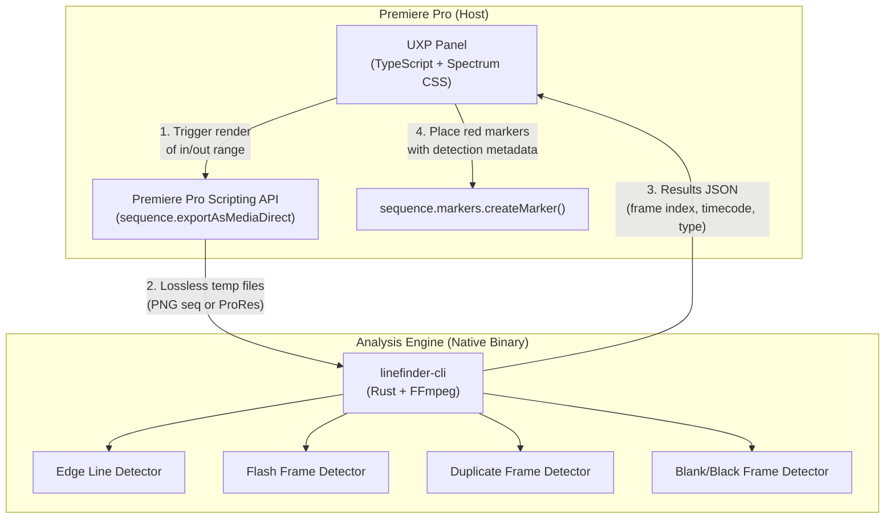
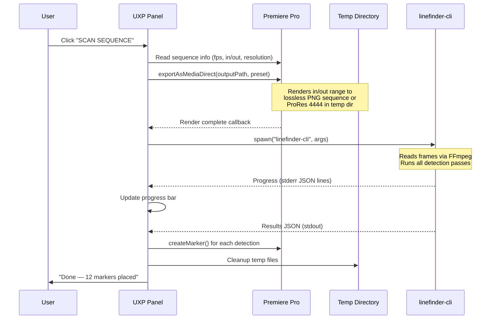

# LineFinder for Premiere Pro — Technical Plan

A standalone, cross-platform (macOS + Windows) Premiere Pro plugin that analyzes rendered sequence frames for edge line glitches, flash frames, duplicate frames, and blank/black frames — then places red markers directly on the timeline at every detection point.

---

## Architecture Overview



---

## Component Breakdown

### Component 1: UXP Panel (TypeScript)

The user-facing UI inside Premiere Pro's panel ecosystem.

**Tech stack:** TypeScript, Adobe Spectrum Web Components (Adobe's native design system for UXP), Webpack bundler.

**Responsibilities:**
- Settings UI: target color (hex + swatch), tolerance slider, edge depth, detection toggles
- Trigger sequence render to temp directory via `app.project.activeSequence.exportAsMediaDirect()`
- Spawn the native analysis binary as a child process via UXP's `shell.openExternal()` or Node.js `child_process` (UXP Hybrid Plugin mode)
- Read results JSON and call `app.project.activeSequence.markers.createMarker(ticks)` for each detection
- Progress bar with frame count, ETA, cancel button

**Key UXP APIs used:**

| API | Purpose |
|---|---|
| `app.project.activeSequence` | Get current sequence, in/out points, frame rate |
| `sequence.exportAsMediaDirect()` | Render sequence range to temp files |
| `sequence.markers.createMarker()` | Place red markers at detection timestamps |
| `sequence.getInPointAsTimecode()` | Read user's in/out selection |
| `require('uxp').storage.localFileSystem` | Manage temp render directory |

> [!IMPORTANT]
> **UXP Hybrid Plugin mode** is required to spawn native binaries. This uses a Node.js-like runtime alongside the UXP sandbox, giving us `child_process.spawn()` for launching the Rust CLI. Available since Premiere Pro 2024 (v24.0+).

**Panel UI layout (5 sections):**
1. **SEQUENCE INFO** — Auto-populated: name, resolution, frame rate, duration, in/out range
2. **TARGET COLOR** — Hex input, color swatch, preset buttons (Green, Black, White, Cyan, Magenta, Red), tolerance slider
3. **DETECTION MODES** — Checkboxes: Edge Lines, Flash Frames, Duplicate Frames, Blank/Black Frames
4. **EDGE SETTINGS** — Edge depth stepper, span ratio, full-screen split scan toggle, exposure boost toggle
5. **EXECUTE** — "SCAN SEQUENCE" button, progress bar, cancel, "CLEAR MARKERS" button

---

### Component 2: Analysis Engine — `linefinder-cli` (Rust)

A stateless command-line binary. Reads rendered frames, runs detection algorithms, outputs JSON to stdout. Zero GUI, zero Adobe SDK dependency — pure computation.

**Tech stack:** Rust, `ffmpeg-next` crate (FFmpeg bindings for frame decoding), `serde_json` for output, `rayon` for multi-threaded frame processing.

**Why Rust over C++:**
- Single static binary — no runtime dependencies, no DLLs, no install hassles
- `cargo build --target x86_64-pc-windows-msvc` and `cargo build --target aarch64-apple-darwin` produce native binaries for both platforms from one codebase
- Memory safety eliminates entire classes of bugs (buffer overflows in pixel scanning code)
- `rayon` parallelism gives effortless multi-core frame analysis
- `ffmpeg-next` crate wraps libavcodec/libavformat with safe Rust API

**CLI interface:**

```bash
linefinder-cli \
  --input "/tmp/premiere_render/sequence_%06d.png" \
  --fps 25.0 \
  --start-timecode "01:00:00:00" \
  --target-color "#00FF00" \
  --tolerance 0.25 \
  --edge-depth 12 \
  --min-span 0.70 \
  --scan-full-screen \
  --detect edge,flash,duplicate,blank \
  --exposure-boost 10.0 \
  --ignore-full-black \
  --ignore-full-white \
  --threads 8 \
  --progress           # enables per-frame progress JSON lines to stderr
```

**Output format (JSON to stdout):**

```json
{
  "version": "1.0.0",
  "summary": {
    "total_frames": 45000,
    "scan_duration_ms": 28340,
    "fps_throughput": 1587.5,
    "detections_count": 12
  },
  "detections": [
    {
      "frame_index": 1247,
      "timecode": "01:00:49:22",
      "type": "edge_line",
      "edge": "bottom",
      "thickness_px": 2,
      "span_ratio": 0.94,
      "detected_color": "#00FF00",
      "confidence": 0.97
    },
    {
      "frame_index": 3891,
      "timecode": "01:02:35:16",
      "type": "flash_frame",
      "luminance_delta": 187.3,
      "confidence": 0.99
    },
    {
      "frame_index": 5200,
      "timecode": "01:03:28:00",
      "type": "duplicate_frame",
      "duplicate_of": 5199,
      "ssim": 0.9998
    },
    {
      "frame_index": 8400,
      "timecode": "01:05:36:00",
      "type": "blank_frame",
      "avg_luminance": 2.1
    }
  ]
}
```

**Progress output (JSON lines to stderr, consumed by UXP panel):**

```jsonl
{"frame": 100, "total": 45000, "fps": 1450.2, "detections_so_far": 0}
{"frame": 200, "total": 45000, "fps": 1520.8, "detections_so_far": 1}
```

---

### Detection Algorithms

#### 1. Edge Line Detection (ported from QCpie's [EdgeDetector.swift](file:///Users/riccardofusetti/Documents/Coding/QCpie/Sources/VideoQCLib/EdgeDetector.swift))

Direct port of the existing algorithm. The core logic is ~800 lines of integer pixel math with zero platform dependencies — translates 1:1 to Rust.

**Key features to port:**
- 4-edge scanning (top, bottom, left, right) within configurable `edgeDepth`
- Full-screen internal split-screen line detection
- Chroma bleed compensation for YUV 4:2:0 compression artifacts (green, magenta, red, blue, cyan, yellow target awareness)
- Saturated target desaturation rejection (prevents false flags on natural scenery)
- Welford's online variance for black/white uniformity enforcement
- Frame-wide suppression (12×12 grid sampling to skip solid color slates, fades, chroma backdrops)
- Boundary contrast step verification (prevents false flags where line color matches adjacent picture content)
- Inward continuity lookahead (distinguishes edge artifacts from picture content)
- Exposure boost multiplier for near-black detection
- Highlight expansion for near-white detection

**Performance target:** The existing Swift implementation processes ~1500+ frames/sec on a single core for 1080p BGRA. Rust with SIMD intrinsics and `rayon` parallelism should match or exceed this. For a 30-minute 25fps sequence (45,000 frames), full analysis should complete in **~30 seconds** on an 8-core machine (after the pre-render step).

#### 2. Flash Frame Detection (new)

Detects single frames (or 2–3 frame bursts) with extreme luminance jumps relative to neighboring frames — typically caused by bad edits, accidental flash inserts, or corrupt frames.

```
Algorithm:
1. Compute per-frame average luminance (Rec.709 weighted: 0.2126R + 0.7152G + 0.0722B)
2. For each frame, compute delta = |luma[i] - luma[i-1]|
3. Flag if delta > threshold (default: 80 luma units) AND the frame returns to
   similar luminance within 1–3 frames (distinguishes flash from legitimate scene cuts)
4. Report: frame index, luminance delta, confidence
```

#### 3. Duplicate Frame Detection (new)

Detects identical or near-identical consecutive frames — can indicate encoding errors, stuck frames, or timeline mistakes.

```
Algorithm:
1. Compute perceptual hash (pHash) or SSIM between consecutive frames
2. Flag if SSIM > 0.9995 (near-identical) for frames that aren't intentionally
   still (freeze frames are OK — flag only unexpected duplicates in motion sequences)
3. Use motion estimation: compute mean absolute difference (MAD) of a 16×16 block grid.
   If MAD < threshold for the flagged pair but surrounding frames show motion, it's a dup.
4. Report: frame index, duplicate_of frame, SSIM score
```

#### 4. Blank/Black Frame Detection (new)

Detects unintentional black or blank frames mid-sequence (not at head/tail where they're expected).

```
Algorithm:
1. Compute per-frame average luminance
2. Flag if avg_luminance < 3.0 AND frame is not within the first/last N frames
   (configurable head/tail exclusion zone, default 2 seconds)
3. Cluster consecutive black frames into segments
4. Report: frame index, avg luminance, segment duration
```

---

## Render Pipeline — How Frames Reach the Analyzer



**Render format choice:**

| Format | Pros | Cons |
|---|---|---|
| **PNG sequence** | Lossless, per-frame random access, easy to debug | Large disk footprint (~6 MB/frame at 1080p), slower I/O |
| **ProRes 4444 MOV** | Compact (~1 MB/frame), fast sequential decode | Requires FFmpeg or QuickTime for decode |
| **Uncompressed AVI** | Zero decode overhead, maximum fidelity | Enormous files, impractical for long sequences |

**Recommendation:** ProRes 4444 MOV as default (best balance of fidelity, size, and decode speed via FFmpeg). PNG sequence as fallback option for Windows users without ProRes support. The CLI binary handles both via FFmpeg — format is transparent to it.

---

## Marker Placement

Each detection produces a Premiere Pro sequence marker:

```typescript
// UXP TypeScript
const seq = app.project.activeSequence;
const ticksPerSecond = 254016000000; // Premiere's internal tick rate

for (const det of results.detections) {
    const frameTimeSec = det.frame_index / fps;
    const ticks = Math.round(frameTimeSec * ticksPerSecond);

    const marker = seq.markers.createMarker(ticks);
    marker.name = det.type === "edge_line"
        ? `⚠ Edge Line: ${det.edge} (${det.thickness_px}px ${det.detected_color})`
        : `⚠ ${formatDetectionType(det.type)}`;
    marker.comments = JSON.stringify(det);
    marker.setColorByIndex(0); // 0 = Red marker
}
```

**Marker behavior:**
- **Red color** for all detections (high visibility in timeline)
- **Marker name** includes detection type and key details (edge, color, thickness)
- **Marker comments** contain full JSON metadata for potential future re-processing
- **"CLEAR MARKERS"** button removes only LineFinder-placed markers (identified by a prefix tag in the comment field)

---

## Project Structure

```
linefinder-premiere/
├── README.md
├── LICENSE
│
├── panel/                          # UXP Panel (TypeScript)
│   ├── package.json
│   ├── manifest.json               # UXP plugin manifest
│   ├── tsconfig.json
│   ├── webpack.config.js
│   ├── src/
│   │   ├── index.ts                # Entry point
│   │   ├── ui/
│   │   │   ├── App.tsx             # Main panel component
│   │   │   ├── SettingsPanel.tsx    # Color, tolerance, detection toggles
│   │   │   ├── ProgressPanel.tsx    # Scan progress UI
│   │   │   └── ResultsPanel.tsx     # Post-scan summary
│   │   ├── premiere/
│   │   │   ├── sequence.ts         # Sequence info helpers
│   │   │   ├── render.ts           # exportAsMediaDirect wrapper
│   │   │   └── markers.ts          # Marker creation/cleanup
│   │   ├── engine/
│   │   │   ├── spawn.ts            # Native binary launcher
│   │   │   └── parser.ts           # JSON results parser
│   │   └── utils/
│   │       ├── timecode.ts         # TC math
│   │       └── config.ts           # User preferences persistence
│   └── dist/                       # Webpack output
│
├── engine/                         # Rust Analysis Engine
│   ├── Cargo.toml
│   ├── Cargo.lock
│   ├── src/
│   │   ├── main.rs                 # CLI entry, arg parsing (clap)
│   │   ├── decoder.rs              # FFmpeg frame decoding pipeline
│   │   ├── detectors/
│   │   │   ├── mod.rs
│   │   │   ├── edge_line.rs        # Port of EdgeDetector.swift
│   │   │   ├── flash_frame.rs      # Luminance delta detector
│   │   │   ├── duplicate_frame.rs  # SSIM / pHash detector
│   │   │   └── blank_frame.rs      # Black/blank detector
│   │   ├── models.rs               # Detection structs, JSON serialization
│   │   ├── config.rs               # QCConfig equivalent
│   │   ├── suppression.rs          # Frame-wide slate/fade suppression
│   │   └── progress.rs             # Stderr progress reporter
│   └── tests/
│       ├── edge_line_tests.rs      # Golden frame test vectors
│       └── test_frames/            # Sample PNG frames for unit tests
│
├── packaging/
│   ├── build_all.sh                # Cross-compile + bundle script
│   ├── sign_notarize_mac.sh        # macOS code signing + notarization
│   ├── sign_windows.ps1            # Windows Authenticode signing
│   └── ccx/                        # Adobe CCX packaging for Exchange
│       └── manifest.xml
│
└── assets/
    ├── icon_dark.png               # Panel icon (dark theme)
    ├── icon_light.png              # Panel icon (light theme)
    └── preview.png                 # Adobe Exchange listing screenshot
```

---

## Build & Distribution

### Cross-Compilation Matrix

| Target | Rust Target Triple | FFmpeg Linking | Notes |
|---|---|---|---|
| macOS x86_64 | `x86_64-apple-darwin` | Static (musl) | Intel Macs |
| macOS ARM64 | `aarch64-apple-darwin` | Static (musl) | Apple Silicon |
| macOS Universal | Fat binary via `lipo` | — | Ship one binary for both |
| Windows x64 | `x86_64-pc-windows-msvc` | Static | Requires MSVC build tools |

### Distribution Options

| Channel | Pros | Cons |
|---|---|---|
| **Adobe Exchange** | Discoverability, trusted install, auto-updates | 15% revenue share, review process, restrictive guidelines |
| **Direct download (Gumroad / website)** | Full control, 0% cut, instant updates | Manual install (drag CCX), no discoverability |
| **GitHub Releases** | Free, open-source friendly, CI/CD via GitHub Actions | No payment integration, requires manual install |

> [!TIP]
> **Recommended initial strategy:** Ship v1.0 as a direct download (Gumroad or own site) with a free tier (limited to 1000 frames/scan) and a paid tier (unlimited). Apply to Adobe Exchange once stable. Keep the Rust engine MIT-licensed for community contributions; keep the UXP panel source proprietary if going commercial.

### Code Signing Requirements

- **macOS:** Apple Developer ID + notarization required for Gatekeeper. The Rust binary must be signed and notarized or macOS will block it. Cost: $99/year Apple Developer Program.
- **Windows:** Authenticode code signing certificate recommended to avoid SmartScreen warnings. Cost: ~$70-200/year from DigiCert, Sectigo, etc.

---

## Development Phases

### Phase 1: Rust Analysis Engine (2–3 weeks)
- [ ] Scaffold Rust project with `clap` CLI, `ffmpeg-next`, `serde_json`, `rayon`
- [ ] Port `EdgeDetector.swift` → `edge_line.rs` (direct translation of all ~800 lines)
- [ ] Port `QCConfig` and `DetectionModels` → `config.rs` + `models.rs`
- [ ] Implement FFmpeg frame decode pipeline (`decoder.rs`)
- [ ] Implement frame-wide suppression (`suppression.rs`)
- [ ] Add flash frame, duplicate frame, blank frame detectors
- [ ] Progress reporting (stderr JSON lines)
- [ ] Unit tests with golden test frames (known-good PNG frames with and without edge lines)
- [ ] Cross-compile and verify on macOS + Windows

### Phase 2: UXP Panel (2–3 weeks)
- [ ] Scaffold UXP Hybrid Plugin project (TypeScript + Webpack + Spectrum CSS)
- [ ] Implement settings UI (5 sections matching QCpie's design language)
- [ ] Implement sequence render trigger (`exportAsMediaDirect`)
- [ ] Implement native binary spawn + progress streaming
- [ ] Implement marker placement logic
- [ ] Implement "CLEAR MARKERS" (removes only LineFinder markers)
- [ ] Test full flow end-to-end in Premiere Pro 2024/2025

### Phase 3: Polish & Distribution (1–2 weeks)
- [ ] Code signing (macOS notarization + Windows Authenticode)
- [ ] Adobe CCX packaging
- [ ] README, documentation, demo video
- [ ] License key system (if commercial)
- [ ] GitHub Actions CI/CD: auto-build + auto-sign on tag push

**Total estimated timeline: 5–8 weeks** of focused development to a shippable v1.0.

---

## Risk Assessment

| Risk | Severity | Mitigation |
|---|---|---|
| UXP Hybrid Plugin `child_process` might have sandboxing restrictions | Medium | Test early in Phase 1. Fallback: use `shell.openExternal()` with a wrapper script that pipes results to a temp file |
| `exportAsMediaDirect` API might not support lossless formats or might require AME | Medium | Test early. Fallback: use `app.encoder.encodeSequence()` which queues to Adobe Media Encoder |
| FFmpeg static linking on Windows is complex | Low | Use `vcpkg` or pre-built static FFmpeg libs. Well-documented in Rust ecosystem |
| Apple notarization rejects unsigned dylibs bundled by FFmpeg | Low | Use fully static linking (`musl`) to eliminate dylib dependencies |
| Premiere Pro marker API has tick precision limitations | Low | Use `sequence.createSubclip()` workaround if needed, or round to nearest frame boundary |

---

## Open Questions

> [!IMPORTANT]
> **Plugin naming:** "LineFinder" as a standalone brand, or "LineFinder by QCpie" to build brand association? The former is cleaner for a standalone product; the latter builds cross-product awareness.

> [!IMPORTANT]
> **Render resolution:** Should the plugin analyze at full resolution by default, or offer a "fast scan" mode at 50% res for quick passes? Half-res analysis is 4x faster but might miss 1px edge lines. I'd recommend full-res only for accuracy.

> [!IMPORTANT]
> **Premiere marker limit:** Premiere Pro handles thousands of markers fine, but sequences with 500+ glitch frames might produce noisy timelines. Should we consolidate consecutive detections into segment markers (matching QCpie's `GlitchSegment` grouping) instead of per-frame markers?
